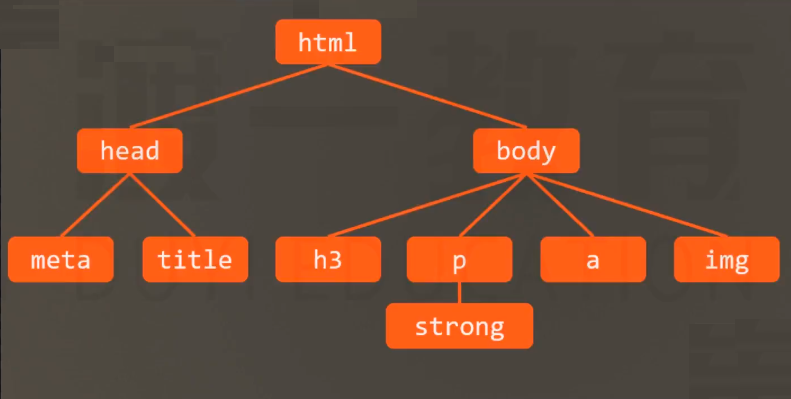

# 属性值的计算过程
一个元素一个元素依次渲染，顺序按照页面文档的树形目录结构进行

渲染每个元素的前提条件：该元素的所有CSS树形必须有质

一个元素，从所有属性都没值，到所有的属性都有值，这个计算过程，叫属性值计算过程

无属性值
1. 确定声明值 
2. 层叠冲突  // a元素第二步就有冲突了 浏览器给设置了属性 解决冲突设置了inherit值   使用inherit就不会走到第三步继承  a的属性不是第三部继承得来的
3. 使用继承
4. 使用默认值
每个属性都有值

特殊的两个CSS取值:
- inherit: 手动(强制)继承，将父元素的值取出应用到该元素
- initial：初始值，将该属性设置为默认值